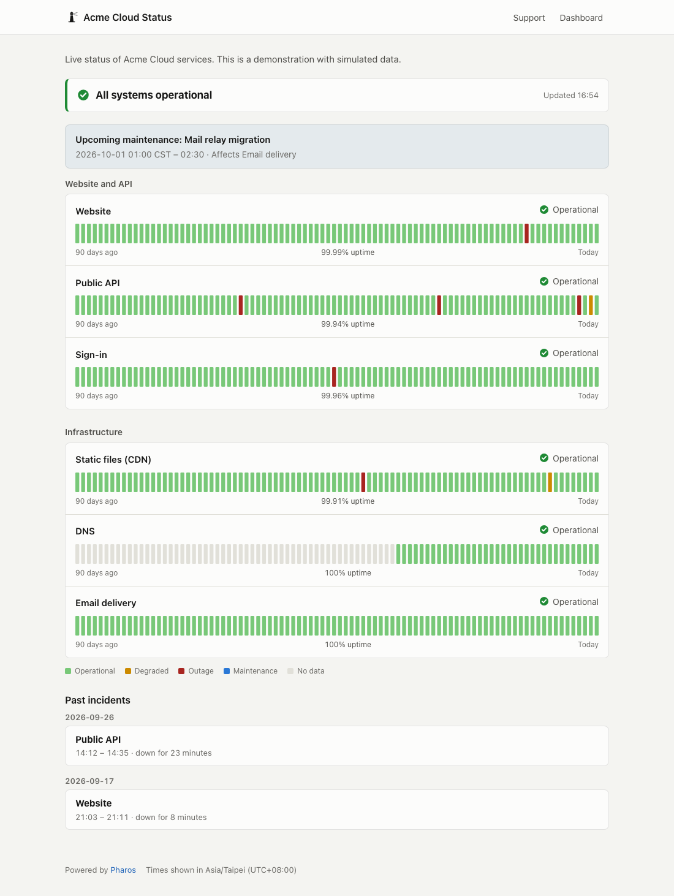
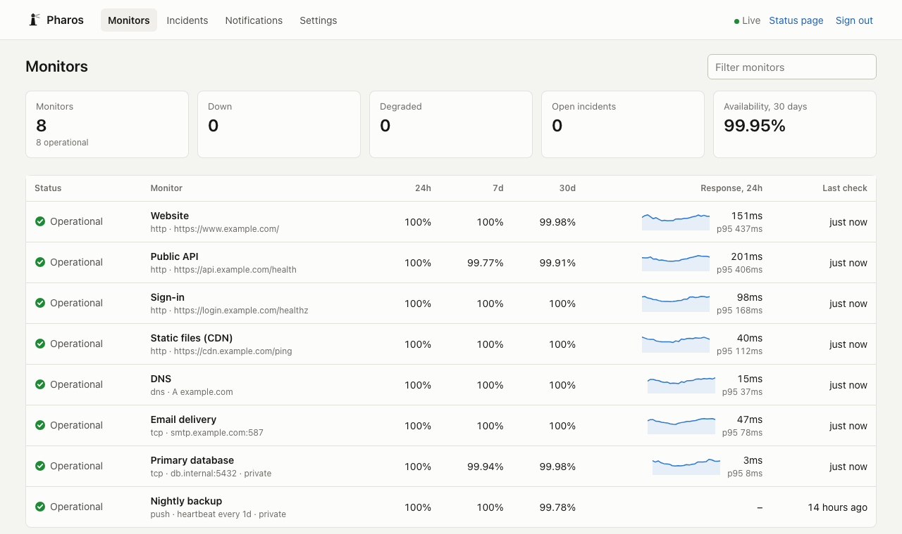

<p align="left">
  
</p>

# Pharos

**Uptime monitoring and a public status page, in a single binary.**

Pharos checks your websites, APIs, servers and scheduled jobs, alerts you when something is really down, and publishes an honest status page. It is one file with an embedded SQLite database: no Node, no Redis, no external database.

[](https://github.com/useless-husband/pharos/actions/workflows/ci.yml)
[](https://github.com/useless-husband/pharos/releases)
[](https://pkg.go.dev/github.com/useless-husband/pharos)
[](LICENSE)

**[Live demo](https://useless-husband.github.io/pharos/)** (simulated data) · [繁體中文說明](README.zh-TW.md) · [Documentation](docs/)



## Why Pharos

- **Alerts you can trust.** A monitor is down only after several consecutive failures (you choose how many), and the outage is dated from the first one. A single timeout at 3 a.m. does not page anyone; a real outage is reported with its true start time.
- **Availability that means something.** Availability is computed from time spent in each confirmed state, not by counting checks. Planned maintenance, paused monitors and periods when Pharos itself was not running are excluded, so 99.9% is a number you can put in a report.
- **Private by default.** Only the monitors you list appear on the public page, and raw error messages, which can reveal internal hostnames, stay in the dashboard unless you choose to publish them. The dashboard refuses remote access until you set a password.
- **Operationally boring.** Configuration as code with precise error messages, hot reload, Prometheus metrics, a JSON API, badges, a hardened systemd unit and a distroless container around a single 15 MB binary. English and Traditional Chinese.



## Features

**Checks** — HTTP(S) with status, header, body, regex and JSON assertions, and a DNS / connect / TLS / server-time breakdown · TCP with optional banner · TLS certificate validity and expiry · DNS records · ICMP ping · push heartbeats for cron jobs and backups · response-time thresholds that mark a service *degraded*.

**Status page** — 90-day history per service · incident history · maintenance announcements · groups · automatic refresh · light and dark themes · static export for hosting anywhere.

**Alerts** — Slack, Discord, Telegram, ntfy, email and signed webhooks · recovery messages with outage length · reminders while an outage lasts · certificate expiry warnings · retries with backoff and a delivery log.

**Dashboard** — live updates · response-time charts with outages marked · check log · pause and resume · heartbeat URLs · notifier tests · configuration reload.

## Quick start

Try it with simulated data, no configuration needed:

```sh
docker run --rm -p 8080:8080 ghcr.io/useless-husband/pharos demo -listen :8080
```

Then open <http://localhost:8080> for the status page and <http://localhost:8080/admin> for the dashboard.

To monitor your own services:

```sh
# 1. Get Pharos: Docker, a release binary, or Go 1.26+
go install github.com/useless-husband/pharos/cmd/pharos@latest

# 2. Write and check a configuration
pharos init                      # writes a commented pharos.yaml
pharos validate -c pharos.yaml

# 3. Run it
pharos run -c pharos.yaml
```

A minimal configuration:

```yaml
status_page:
  title: Example Status
  groups:
    - name: Website
      monitors: [homepage, api]

defaults:
  notify: [chat]

notifiers:
  - name: chat
    type: discord
    url: ${DISCORD_WEBHOOK_URL}

monitors:
  - id: homepage
    name: Homepage
    type: http
    url: https://example.com/
    expect:
      max_latency: 2s

  - id: api
    name: API
    type: http
    url: https://api.example.com/health
    expect:
      json: [{ path: status, equals: ok }]

  - id: backup
    name: Nightly backup
    type: push          # the job calls a URL when it finishes
    heartbeat: 24h
```

Binaries for Linux, macOS, Windows and FreeBSD are on the [releases page](https://github.com/useless-husband/pharos/releases). See [deployment](docs/deployment.md) for Docker Compose, systemd and reverse proxies.

## How Pharos decides something is down

```
checks     ✓  ✓  ✗  ✓  ✓  ✗  ✗  ✗  ✗  ✗  ✓  ✓  ✓
                  │           └──┴──┤           └──┤
             one blip:        3 failures:      2 successes:
             ignored          DOWN, dated      recovered, dated
                              from the first   from the first
```

With the default `confirm: {down: 3, up: 2}`, the outage above starts at the first of the three failures and ends at the first of the two successes. While a failure is being confirmed, Pharos checks every `retry_interval` (15 s by default), so an outage is confirmed in well under a minute even with a longer interval. The [architecture document](docs/architecture.md) covers the details, including how restarts are accounted for.

## Documentation

- [Configuration reference](docs/configuration.md) — every setting, with defaults
- [Notifications](docs/notifications.md) — channels, webhook payload and signature
- [Deployment](docs/deployment.md) — Docker, systemd, reverse proxies, backups
- [HTTP API](docs/api.md) — status JSON, push, badges, Prometheus metrics
- [Architecture](docs/architecture.md) — how it works and why

## Choosing a tool

Good open-source monitors already exist, and the right one depends on how you work:

- **[Uptime Kuma](https://github.com/louislam/uptime-kuma)** is configured by clicking through a web interface and supports a very long list of monitor types and notification services.
- **[Gatus](https://github.com/TwiN/gatus)** is also a single Go binary configured with YAML, with a rich condition language for checks.
- **[Upptime](https://github.com/upptime/upptime)** needs no server at all: it runs on GitHub Actions and publishes to GitHub Pages.

Pharos is for you if you want configuration in version control, alerts that wait for confirmation and carry the real start time, availability that excludes maintenance and monitoring gaps, a status page that keeps internal details private by default, and a dependency-light codebase (about 10,000 lines of Go, no web framework) that is organized so each part can be read on its own.

## Development

```sh
make test      # unit and integration tests
make race      # with the race detector
make lint      # gofmt, go vet, staticcheck
make demo      # build and run the demo
```

The code is organized by responsibility under `internal/`; start with [docs/architecture.md](docs/architecture.md). Contributions are welcome: see [CONTRIBUTING.md](CONTRIBUTING.md). Report security issues privately as described in [SECURITY.md](SECURITY.md).

## License

[MIT](LICENSE)
