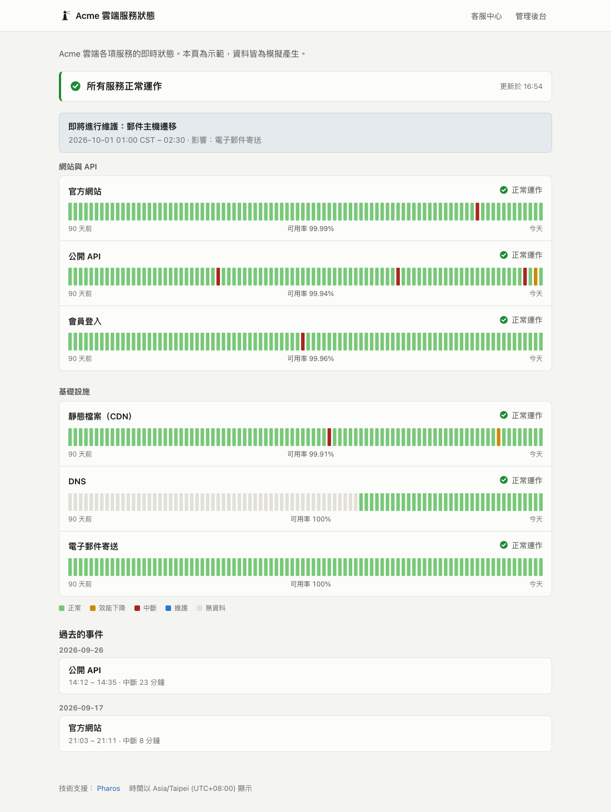

<p align="left">
  
</p>

# Pharos

**服務監控與公開狀態頁，一個執行檔就能跑。**

Pharos 會持續檢查你的網站、API、伺服器和排程工作，在服務「真的」中斷時通知你，並產生一個誠實的公開狀態頁。整個程式就是一個檔案，內建 SQLite 資料庫：不需要 Node、不需要 Redis，也不需要另外架資料庫。

[](https://github.com/useless-husband/pharos/actions/workflows/ci.yml)
[](https://github.com/useless-husband/pharos/releases)
[](LICENSE)

**[線上示範](https://useless-husband.github.io/pharos/zh-TW/)**（模擬資料）· [English](README.md) · [文件（英文）](docs/)



## 為什麼用 Pharos

- **值得信任的警報。** 要連續失敗好幾次（次數可以自己設定）才算中斷，而且中斷時間從「第一次失敗」算起。半夜偶爾一次逾時不會把人叫醒；真的出事時，回報的開始時間也是準的。
- **有意義的可用率。** 可用率依「確認後的狀態持續多久」計算，而不是數檢查次數。預定維護、暫停的監控、以及 Pharos 自己沒在運作的時段都會排除，所以 99.9% 是一個可以放進報告裡的數字。
- **預設保護隱私。** 公開頁只顯示你指定的監控項目；錯誤訊息（可能透露內部主機名稱）預設只留在管理後台。在你設定密碼之前，管理後台拒絕所有遠端連線。
- **維運上很省心。** 設定寫在檔案裡、可以進版本控制，錯誤訊息會標出第幾行；支援熱重載、Prometheus 指標、JSON API、徽章、強化過的 systemd 設定，以及只包一個 15 MB 執行檔的 distroless 容器。介面有英文和繁體中文。

## 功能

**檢查類型**：HTTP(S)（可驗證狀態碼、標頭、內文、正規表達式、JSON 欄位，並拆解 DNS／連線／TLS／伺服器處理時間）、TCP（可檢查歡迎訊息）、TLS 憑證有效性與到期日、DNS 記錄、ICMP Ping、給排程工作和備份用的心跳（push）監控，以及把「太慢」標成「效能下降」的回應時間門檻。

**狀態頁**：每個服務 90 天的每日紀錄、事件紀錄、維護公告、分組、自動更新、淺色與深色主題，也能匯出成靜態網頁放在任何地方。

**通知**：Slack、Discord、Telegram、ntfy、Email，以及帶簽章的 Webhook。恢復時會附上中斷多久；長時間中斷會定期提醒；憑證快到期會預警；傳送失敗會自動重試，並保留傳送紀錄。

**管理後台**：即時更新、標出中斷時段的回應時間圖、檢查紀錄、暫停與恢復、心跳網址、通知測試、重新載入設定。

## 快速開始

先用模擬資料試用，不需要任何設定：

```sh
docker run --rm -p 8080:8080 ghcr.io/useless-husband/pharos demo -listen :8080 -lang zh-TW
```

打開 <http://localhost:8080> 看狀態頁，<http://localhost:8080/admin> 看管理後台。

監控你自己的服務：

```sh
# 1. 取得 Pharos：Docker、Releases 的執行檔，或用 Go 1.26 以上安裝
go install github.com/useless-husband/pharos/cmd/pharos@latest

# 2. 產生並檢查設定檔
pharos init                      # 產生附註解的 pharos.yaml
pharos validate -c pharos.yaml

# 3. 啟動
pharos run -c pharos.yaml
```

最精簡的設定檔：

```yaml
status_page:
  title: 服務狀態
  language: zh-TW
  timezone: Asia/Taipei
  groups:
    - name: 網站
      monitors: [homepage, api]

defaults:
  notify: [chat]

notifiers:
  - name: chat
    type: discord
    url: ${DISCORD_WEBHOOK_URL}

monitors:
  - id: homepage
    name: 官方網站
    type: http
    url: https://example.com/
    expect:
      max_latency: 2s

  - id: api
    name: API
    type: http
    url: https://api.example.com/health
    expect:
      json: [{ path: status, equals: ok }]

  - id: backup
    name: 每日備份
    type: push          # 排程工作完成時呼叫一個網址
    heartbeat: 24h
```

Linux、macOS、Windows、FreeBSD 的執行檔都在 [Releases 頁面](https://github.com/useless-husband/pharos/releases)。Docker Compose、systemd、反向代理的設定請看[部署文件](docs/deployment.md)。

## Pharos 怎麼判斷服務中斷

```
檢查結果   ✓  ✓  ✗  ✓  ✓  ✗  ✗  ✗  ✗  ✗  ✓  ✓  ✓
                  │           └──┴──┤           └──┤
             偶發一次：        連續 3 次失敗：    連續 2 次成功：
             忽略             判定中斷，時間     判定恢復，時間
                              從第一次算起       從第一次算起
```

預設 `confirm: {down: 3, up: 2}` 時，上圖的中斷從三次失敗的第一次開始，到兩次成功的第一次結束。在確認失敗的期間，Pharos 會改用 `retry_interval`（預設 15 秒）加快檢查，所以就算檢查間隔設得比較長，也能在一分鐘內確認中斷。細節（包括 Pharos 重啟時怎麼計算）請看[架構文件](docs/architecture.md)。

## 文件

- [設定參考](docs/configuration.md)：每個設定項目與預設值
- [通知](docs/notifications.md)：各管道設定、Webhook 內容與簽章驗證
- [部署](docs/deployment.md)：Docker、systemd、反向代理、備份
- [HTTP API](docs/api.md)：狀態 JSON、心跳、徽章、Prometheus 指標
- [架構](docs/architecture.md)：運作原理與設計取捨

## 怎麼選擇監控工具

開源的監控工具已經有很好的選擇，適合哪一個取決於你的習慣：

- **[Uptime Kuma](https://github.com/louislam/uptime-kuma)**：在網頁介面上點選設定，支援非常多種監控類型和通知服務。
- **[Gatus](https://github.com/TwiN/gatus)**：同樣是一個 Go 執行檔、用 YAML 設定，檢查條件的語法很豐富。
- **[Upptime](https://github.com/upptime/upptime)**：完全不需要伺服器，跑在 GitHub Actions 上並發佈到 GitHub Pages。

如果你希望設定檔能放進版本控制、警報要確認過才發而且帶著真正的開始時間、可用率排除維護和監控空窗、狀態頁預設不外洩內部資訊，以及一個依賴很少、約一萬行 Go 且每個部分都能單獨閱讀的程式碼，Pharos 會適合你。

## 開發

```sh
make test      # 單元與整合測試
make race      # 開啟 race detector
make lint      # gofmt、go vet、staticcheck
make demo      # 建置並執行示範
```

程式碼依職責放在 `internal/` 底下，建議從[架構文件](docs/architecture.md)開始看。歡迎貢獻，請參考 [CONTRIBUTING.md](CONTRIBUTING.md)；資安問題請依 [SECURITY.md](SECURITY.md) 私下回報。

## 授權

[MIT](LICENSE)
