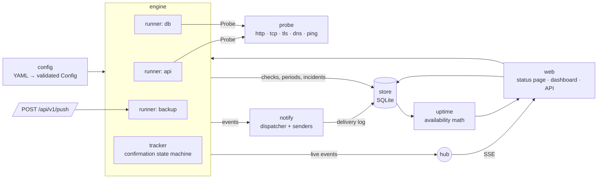
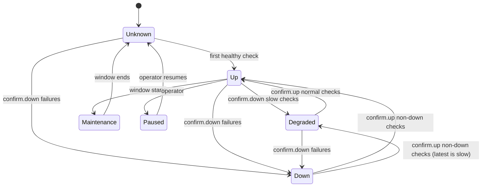

# Architecture

This document explains how Pharos is put together and why. It is written for contributors and for anyone deciding whether to trust its numbers.

## Components



| Package | Responsibility |
|---|---|
| `config` | Parse YAML, expand `${ENV}`, apply defaults, validate with line numbers, compile maintenance windows. |
| `probe` | Perform one check of each type and describe failures in one line. Probes never retry. |
| `engine` | Schedule checks, turn results into confirmed status changes, handle maintenance, pause, push heartbeats, reminders, certificate warnings and hot reload. |
| `store` | SQLite schema, migrations and queries. One writer connection, a pool of readers. |
| `uptime` | Pure functions from status periods to availability and daily history. |
| `notify` | Render events in English or Chinese and deliver them with retries. |
| `web` | HTTP handlers, templates, authentication, the JSON API, badges, metrics and static export. |
| `demo` | A deterministic demonstration data set and a simulated prober. |

## From a check to an incident

Each monitor has its own goroutine (a *runner*). After a start-up jitter derived from the monitor id, which spreads load after a restart, it probes on its interval. A shared semaphore bounds how many checks run at once. While a failure is being confirmed, or while the monitor is down, the runner switches to `retry_interval`.

Every result is stored, then fed to the monitor's *tracker*:



A change is dated from the **first check of the confirming streak**. If checks at 10:00, 10:00:15 and 10:00:30 fail and confirm an outage, the outage began at 10:00, not 10:00:30. A streak that is interrupted by a disagreeing result is discarded, so a flapping service does not alert on every blip.

A confirmed change is written in one transaction: the open status period is closed, the next one opened, and an incident opened (entering *down*) or closed (leaving it). Then the change becomes events: `down`, `up`, `degraded`, published to the notifier and to the live hub.

## Availability is computed from time, not from check counts

Many tools report availability as *successful checks / all checks*. That number depends on the check interval, counts unconfirmed blips, and cannot tell planned maintenance from an outage. Pharos stores **confirmed status periods** instead and computes

```
availability = (up + degraded) / (up + degraded + down)
```

over the time in the window. Maintenance, paused and unknown time are excluded from both sides. The daily history bars are the same computation per local calendar day.

### When Pharos itself was not running

If Pharos stops, nobody observed the monitors in the meantime, and counting that gap as *up* would overstate availability. Pharos writes a liveness mark every 30 seconds and at shutdown. On the next start, each monitor that was up or degraded is moved to *unknown* from its last check or the last liveness mark, whichever is later, so the gap is excluded. Two cases are deliberately different:

- An **ongoing outage stays open** across the restart. It was down when Pharos stopped and there is no evidence it recovered.
- A **push monitor keeps its status**: its state is defined by the heartbeat deadline, which restarts from the new start time.

## Storage

SQLite in WAL mode, through `modernc.org/sqlite`, a C-free driver, so Pharos cross-compiles to every platform without cgo. All writes go through one connection, which matches SQLite's single-writer model and avoids `SQLITE_BUSY` storms; dashboard reads use a separate pool and never block the checker.

| Table | Contents | Kept |
|---|---|---|
| `checks` | Every result: status, latency, message, timing phases, certificate expiry | `storage.retention` (default 30 days) |
| `periods` | Confirmed status intervals | 400 days |
| `incidents` | Outages with cause and resolution | 400 days |
| `latency_hourly` | Count, sum, min, max, p50 and p95 per monitor and hour | 400 days |
| `notifications` | Delivery attempts | 400 days |
| `monitors`, `meta` | Pause switches, certificate warning state, secrets, liveness | – |

Hourly aggregates are rolled up every five minutes from completed hours, so long-range charts stay fast after raw checks are pruned. The current hour is always computed from raw checks. Pruning deletes in batches of 5,000 rows to keep write transactions short. Migrations are append-only and run at start-up.

## The web layer

- **Server-rendered HTML** with `html/template`: every page works without JavaScript. Scripts add live updates, tooltips and the response-time chart, and a data table is always available as a fallback.
- **Strict Content Security Policy**: `script-src 'self'`, no inline scripts or styles. Charts that scale cleanly (history bars, sparklines, timing bars) are server-side SVG; the response-time chart is drawn in the browser at the container's real pixel size so its text stays legible on phones.
- **Live updates** use server-sent events. The dashboard refetches the page and swaps only the regions marked `data-live`, so an open table or chart is not disturbed.
- **Sessions** are stateless signed cookies (HMAC-SHA256 over user, expiry and a nonce) with a secret stored in the database. CSRF tokens are derived from the session nonce; writes also check `Origin`.
- **No-password mode** only admits loopback clients, and never a request carrying proxy headers without `trust_proxy`: behind a local reverse proxy every request would otherwise look local.
- **Private by default**: monitors outside status page groups, and raw failure messages, never reach public endpoints. The static export renders as an anonymous visitor for the same reason.

## Notifications

The dispatcher routes an event to the monitor's notifiers, filtered by each notifier's `events`. Each delivery runs in its own goroutine (at most eight send at once) with backoff of 5 s, 30 s, 2 min and 10 min. A 4xx response other than 408 or 429 is permanent and not retried. Every attempt is logged in the database. On shutdown the dispatcher waits up to ten seconds for in-flight deliveries; entries still pending at the next start are marked as interrupted.

## Testing

- **Time is injected.** The engine uses a `clock.Clock`; tests drive a fake clock whose timers can be stopped, so scheduling, retry intervals, heartbeat deadlines, reminders and restarts are tested deterministically without sleeping.
- **Real I/O where it matters.** Probe tests run against local HTTP, TLS, TCP and DNS servers; notifier tests use local webhook and SMTP servers; store and engine tests use real SQLite files.
- **Race detector in CI** on Linux, macOS and Windows.
- **Web tests** exercise authentication, CSRF, rate limiting, the local-only rule behind proxies, privacy of private monitors, the API shape, push, badges, metrics syntax and the static export against a seeded 90-day data set.
